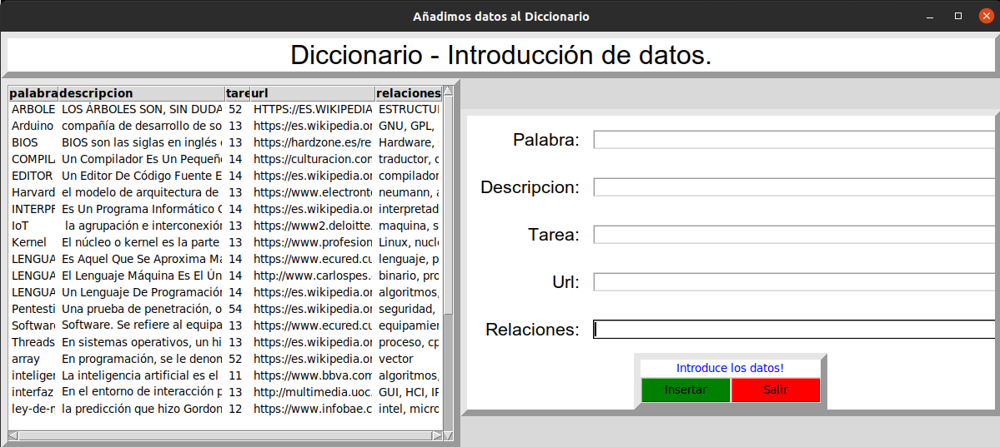
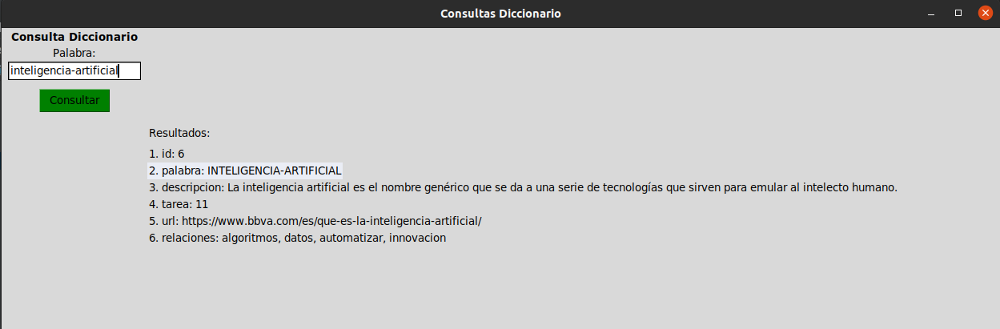
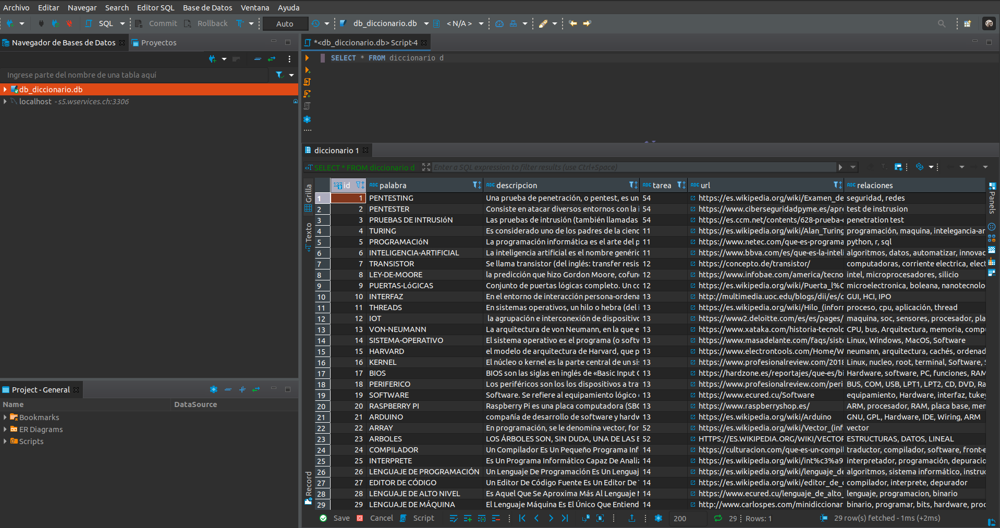

# DICCIONARIO

🖐️ 👷 🖥️ [codigo](./) 💻 🎆 📁 🗄️ 📂

En este apartado detallo como estoy elaborando mi diccionario de terminos.

Para ello he utilizado Python para programar 2 programas (introducción de terminos y consulta) y de SQL donde guardo 
los datos.

Mi diccionario se compone de:
* Palabra
* Definición
* Número de tarea correspondiente
* URL donde he capturado dichos datos
* Las palabras relacionadas con la definición

El software utilizado es Pycharm y DBeaver Community

### connection.py 
Conecta con la base de datos y en caso de no existir la base de datos, la genera así como su tabla correspondiente

### input.py
Se trata de una aplicación GUI destinada a introducir los componentes del diccionario

### consulta.py
Permite la consulta de cada una de las palabras.

### db_diccionario.db
Y dentro de ella se encuentra la tabla diccionario donde se almacenan los datos introducidos anteriormente.

## Ejecución

Para su ejecución:
Utilizar la terminal y ejecutar:  

    $python input.py 
    $python consulta.py

