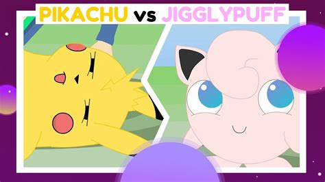
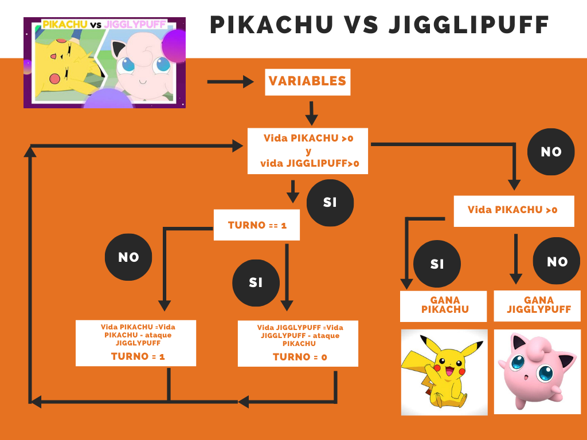

### Construir tu primer diagrama de flujo

#### para ejecutar: 
# $python picachu_combate.py

# El juego de Picachu


En programación no suele ser una buena práctica empezar a programar la solución antes de pensar bien cuál va a ser la arquitectura del programa. Es importante hacer el plano del software antes de empezar a picar código.  
  
Si os fijáis bien, los programas que habéis desarrollado hasta ahora no son mas que un cúmulo de bucles que saltan de uno a otro para la resolución de un problema más complejo. Sabiendo esto, es importante dibujar esos bucles en "lápiz y papel" para ver clara la problemática y su posterior resolución. Estos dibujos se conocen como diagramas de flujo y se utilizan tanto para planificar el desarrollo de un software como para diseños en otras disciplinas que nada tienen que ver con la informática.  

En este caso, tenéis que entender y dibujar el diagrama de flujo del programa de picachu tal y como se explica en el vídeo que adjuntamos y posteriormente codificarlo mediante un lenguaje de programación, es decir, construir el programa tal cual se indica en el diagrama.  
  
Chulo, ¿verdad?  


###HASHTAGS (etiquetas de ayuda para búsqueda de información relevante) #diagrama-de-flujo #bucles #if #for #while #switch-case #array #bases-de-datos 

LINKS DE INTERÉS  
https://www.youtube.com/watch?v=SDv2vOIFIj8   
https://www.areatecnologia.com/informatica/ejemplos-de-diagramas-de-flujo.html  

DICCIONARIO  

diagrama-de-flujo | bucles-en-programación


PUNTUACIÓN

Programación: 4
Redes: 1
Seguridad: 1
Algoritmia: 4


```python
class Pokemon:
    def __init__(self, nombre, puntos_vida, puntos_ataque):
        """
        Creamos el objeto: nombre, puntos de vida y puntos de ataque
        """
        self.nombre = nombre
        self.puntos_vida = puntos_vida
        self.puntos_ataque = puntos_ataque

    def sufre_ataque(self, danos):
        """
        Función del ataque
        """
        self.puntos_vida = self.puntos_vida - danos

    def esta_vivo(self):
        """
        Función que comprueva la vida del pikachu
        """
        # Si es mayor a 0 está vivo
        if self.puntos_vida > 0:
            return True
        # En caso contrario, no lo eá
        else:
            return False
```


```python
def anunciar_ganador(ganador):
    """
    Función que anuncia el ganador
    """
    print("Gana: {}!".format(ganador.nombre))
```


```python
def lucha(pok1, pok2):
    """
    Funciónn de lucha
    """
    pok1_turno = True
    # Inicializamos ronda
    ronda = 0
    # generamos el bucle
    while pok1.esta_vivo() and pok2.esta_vivo():
        # vamos incrementando las rondas desde la primera
        ronda = ronda + 1
        # Si hay turno
        if pok1_turno:
            # el pok2 sufre el ataque del 1
            pok2.sufre_ataque(pok1.puntos_ataque)
         # caso contrario
        else:
             # el pok2 sufre el ataque del 1
            pok1.sufre_ataque(pok2.puntos_ataque)
        # finaliza cuando ya no hay turno
        pok1_turno = not pok1_turno
    # Si el pokemon 1 está vivo
    if pok1.esta_vivo():
        anunciar_ganador(pok1)
    else:
        anunciar_ganador(pok2)
```

### Introducimos los datos necesarios para la lucha


```python
print("Inserta los puntos de vida de Pikachu")
pikachu_puntos_vida = int(input())
print("Inserta los puntos de vida de jigglipuff")
jigglipuff_puntos_vida = int(input())
print("Inserta los puntos de ataque de Pikachu")
pikachu_puntos_ataque = int(input())
print("Inserta los puntos de ataque de jigglipuff")
jigglipuff_puntos_ataque = int(input())
```

    Inserta los puntos de vida de Pikachu


     100


    Inserta los puntos de vida de jigglipuff


     100


    Inserta los puntos de ataque de Pikachu


     25


    Inserta los puntos de ataque de jigglipuff


     20


```python
# Aplicamos los datos introducidos al objeto indicado en un inicio
pikachu = Pokemon("Pikachu", pikachu_puntos_vida, pikachu_puntos_ataque)
jigglipuff = Pokemon("Jigglipuff", jigglipuff_puntos_vida, jigglipuff_puntos_ataque)
```

## Toca luchar


```python
lucha(pikachu, jigglipuff)
```

    Gana: Pikachu!

# Flujo:

