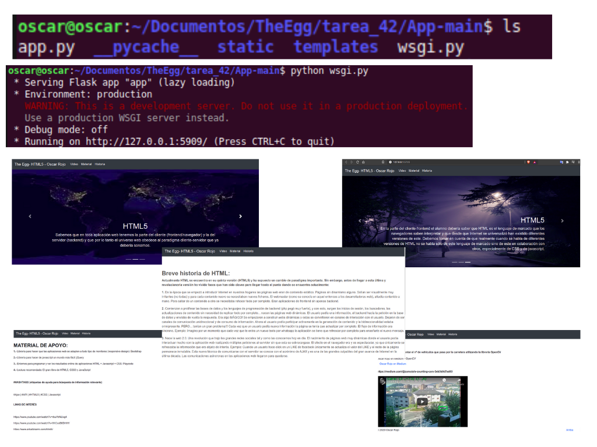

# HTML5, la revolución de los navegadores
===================================================
## Descargar: App-main
## Ejecutar: $python wsgi.py
===================================================

Entender la web y el protocolo que lo hace posible ([http](https://developer.mozilla.org/es/docs/Web/HTTP/Overview)) debería ser una asignatura obligatoria de cualquier disciplina técnica. 
La [interfaz](https://es.wikipedia.org/wiki/Interfaz) web es el canal de comunicación e interacción más importante del 
mundo actual y por ende, todo profesional de IA debería tener unos conocimientos mínimos sobre cómo funciona.  

Sabemos que en toda aplicación web tenemos la parte del cliente (frontend/navegador) y la del servidor (backend) 
y que por lo tanto el universo web obedece al paradigma [cliente-servidor](https://es.wikipedia.org/wiki/Cliente-servidor) que ya debería sonarnos.  

En la parte del cliente-frontend el alumno debería saber que [HTML](https://es.wikipedia.org/wiki/HTML) es el lenguaje de 
marcado que los navegadores saben interpretar y que desde que Internet se universalizó han existido diferentes versiones de este. 
Debemos tomar en cuenta de que realmente cuando se habla de diferentes versiones de HTML no se habla sólo de este lenguaje 
de marcado sino de este en colaboración con otros, especialmente de [CSS](https://www.arumeinformatica.es/blog/css/#:~:text=El CSS (hojas de estilo,(por ejemplo, HTML).&text=Esta separación entre la estructura,aspecto de una página web.) y de [javascript](https://soyrafaramos.com/que-es-javascript-para-que-sirve/).  

Pensemos por un momento que similitudes tienen las redes sociales más conocidas:  

1.- Diseño bonito y usable, adaptable al tamaño de cualquier terminal o monitor (PC, móvil, tablet) gracias al [responsive design](https://www.iebschool.com/blog/que-es-responsive-web-design-analitica-usabilidad/). 
La parte de diseño se hace con CSS.  
2.- Interacción dinámica y usable con el usuario (retweets, botones para compartir contenido, actualización automática de 
información, ...). Este dinamismo se obtiene gracias a Javascript.  
3.- Finalmente, el contenido está estructurado con diferentes elementos (tablas, párrafos, listados, ...).
HTML es el culpable de dar vida a este esqueleto.  

Truco: Si queréis ver el [código fuente](https://es.wikipedia.org/wiki/Código_fuente) frontend de cualquier página, debéis pulsar el botón derecho del ratón una vez posicionado el cursor encima de la web y seleccionar ver código fuente.

En The Egg nos ceñiremos a cubrir unos mínimos en esta materia (ya que no es el propósito de la Escuela que seáis buenos 
desarrolladores web) pero tened en cuenta de que la mayoría de desarrollos de IA comercializables necesitarán de una interfaz 
gráfica mínima para interactuar con el entorno, y esta interfaz, en la mayoría de las ocasiones, será WEB.

Generalmente, a la hora de trabajar en proyectos de gran envergadura, se suele contar con equipos de desarrollo que se 
encargan de dotar de "inteligencia" a las aplicaciones, son los @eggers de cualquier equipo. Por otro lado, hay personas, 
que se encargan de la parte del frontend (del diseño), de provocar que la experiencia de usuario [UX/UI](https://www.neoland.es/blog/que-es-el-ux-ui-design) sea óptima, ...  
Existe también la figura del Full Stack Developer, la persona capaz de establecer las estrategias necesarias para cada parte del proceso de desarrollo.  

### Breve historia de HTML    

Actualmente HTML se encuentra en su quinta versión ([HTML5](https://www.arkaitzgarro.com/html5/capitulo-1.html)) y ha 
supuesto un cambio de paradigma importante. Sin embargo, antes de llegar a esta última y revolucionaria versión ha vivido fases que han sido claves para llegar hasta el punto donde se encuentra actualmente:  
1.- En la época que se empezó a introducir Internet en nuestros hogares las páginas web eran de [contenido estático](https://brandmedia.es/diferencias-pagina-web-estatica-dinamica-mejor/). 
Páginas sin dinamismo alguno. Solían ser visualmente muy irritantes (no todas) y para cada contenido nuevo se necesitaban nuevos ficheros. 
El webmaster (como se conocía en aquel entonces a los desarrolladores web), añadía contenido a mano. Para saltar de un contenido a otro se 
necesitaba rehacer todo por completo. Eran aplicaciones de frontend sin apenas backend.  
2.- Comienzan a proliferar las [bases de datos](https://www.masadelante.com/faqs/base-de-datos) y los lenguajes de programación de backend (php pegó muy fuerte), y con esto, surgen los inicios de sesión, los buscadores, las actualizaciones de contenido sin necesidad de replicar todo por completo... nacen las páginas web dinámicas.
El usuario pedía una información, el backend hacía la petición en la base de datos y enviaba de vuelta la respuesta. 
Era algo MÁGICO! Se empezaron a construir [webs dinámicas](https://brandmedia.es/diferencias-pagina-web-estatica-dinamica-mejor/) y estas se convirtieron en canales de interacción con el usuario. 
Dejaron de ser canales de comunicación unidireccional y de consumo de información. Ahora el usuario podía participar 
activamente en la generación de contenido y la bidireccionalidad estaba omnipresente.
PERO... tenían un gran problema!!! Cada vez que un usuario pedía nueva información la página se tenía que actualizar por completo. 
El flujo de información era [síncrono](https://anexsoft.com/que-es-la-programacion-asincrona-y-sincrona).
Ejemplo: Imagina por un momento que cada vez que te entra un nuevo texto por whatsapp la aplicación se tiene que refrescar 
por completo para enseñarte el nuevo mensaje.  
3.- Nace la [web 2.0](https://es.wikipedia.org/wiki/Web_2.0). Una revolución que trajo las grandes redes sociales tal y como las conocemos hoy en día. El nacimiento de páginas web muy dinámicas donde el usuario podía interactuar mucho con la aplicación web realizando múltiples peticiones al 
servidor sin que esta se sobrecargase. El efecto en el navegador era y es espectacular, ya que únicamente se refrescaba la información que era objeto de interés.
Ejemplo: Cuando un usuario hace click en un LIKE de facebook únicamente se actualiza el valor del LIKE y el resto de la página permanece inmutable.  
Esta nueva técnica de comunicarse con el servidor se conoce con el acrónimo de [AJAX](https://www.youtube.com/watch?v=z2aipCAq2n8) y es una de las grandes culpables del gran avance de Internet en la última década. Las comunicaciones [asincronas](https://anexsoft.com/que-es-la-programacion-asincrona-y-sincrona) en las aplicaciones web llegaron para quedarse.
4.- El último gran cambio llega con la versión HTML5 gracias a sus [API-s](https://www.xataka.com/basics/api-que-sirve). Se pueden realizar operaciones en el cliente que hasta hace poco eran impensables. Desde el propio navegador se puede trabajar con audio y video (antes todo esto se 
hacía en la mayoría de las ocasiones con [flash](https://blog.irontec.com/migrando-del-viejo-flash-html5/)), guardar datos en el navegador (bases de datos en el propio navegador? Uauuu!!!), realizar videoconferencias de cliente a cliente sin necesidad de instalar complementos, diseñar formularios muy avanzados con unas pocas etiquetas, ...
Estas nuevas capacidades de los navegadores son posibles gracias a la última versión HTML5 junto con Javascript y CSS.  

NOTA: Hoy en día también se puede hacer IA en el navegador gracias a la API [tensorflow.js](https://js.tensorflow.org/api/latest/) de google.   

El alumno para superar esta tarea debe:   

1.- Diseñar una estructura básica de [HTML](https://www.hazunaweb.com/curso-de-html/estructura-basica-una-pagina-web/) y verla en el navegador.  
2.- Introducir algo de color a la página apoyándose en [CSS](https://developer.mozilla.org/es/docs/Learn/Getting_started_with_the_web/CSS_basics).  
3.- Añádir un [video](https://desarrolladoresweb.org/html5/etiqueta-video-html5-atributos-propiedades/) gracias a la nueva etiqueta video de html5.  
4.- Serías capaz de darle al play y al pause del video mediante instrucciones por voz (hablando a la computadora) utilizando [javascript](https://www.w3schools.com/js/default.asp)? (no obligatorio).  

MATERIAL DE APOYO:  
1.- Librería para hacer que las aplicaciones web se adapten a todo tipo de monitores (responsive design): [Bootstrap](https://getbootstrap.com/)  
2.- Librería para hacer de javascript un mundo más fácil: [jQuery](https://jquery.com/)   
3.- Entornos para programar y ver los resultados online de aplicaciones HTML + Javascript + CSS: [Playcode](https://playcode.io/)  
4.- Lectura recomendada: [El gran libro de HTML5, CSS3 y JavaScript](https://elevaciondigital.pe/wp-content/uploads/2019/06/El-gran-libro-de-HTML5-CSS3-y-JavaScript.pdf)  

### HASHTAGS (etiquetas de ayuda para búsqueda de información relevante)  

### #Ajax | #API | #HTML5 | #CSS | #Javascript  

LINKS DE INTERÉS  

https://www.youtube.com/watch?v=rbuYtrNUxg4  
  

https://www.youtube.com/watch?v=91CxoB6DHHY  
  
 
[HTML5](https://www.arkaitzgarro.com/html5/)  

https://www.youtube.com/watch?v=mNbnV3aN3KA  
  

DICCIONARIO  

Código-fuente | AJAX | HTML | Javascript | CSS | Síncrono | Asíncrono | Interfaz  

PUNTUACIÓN  

Programación: 5  
Redes: 3  
Seguridad: 1  
Algoritmia: 4  
