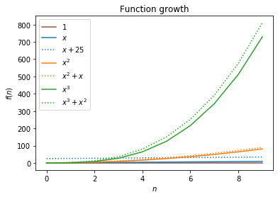
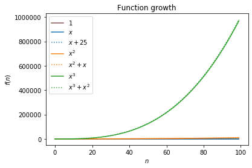

# Tarea 44 - Análisis del rendimiento de las aplicaciones de IA 

## Ejercicio: Debes programar el problema que se plantea en la siguiente secuencia de videos en el lenguaje de programación que desees:

## Primera parte

[](https://www.youtube.com/watch?v=GD254Gotp-4 "video")

#### Reto para hacer:

Definir dos funciones, una, suma_lineal, que lleve a cabo la suma de n números del 1 a n, de una forma básica, y otra, suma_constante, que lleve a cabo la misma tarea, pero utilizando la fórmula de la suma aritmética de los números del 1 a n.


```python
# cargo la función mágica de iPython
%load_ext line_profiler
```


```python
import time
```


```python
def suma_lineal(n):
    pass

def suma_constante(n):
    pass

cantidad = 1000000

def ejemplo(cantidad):
    
    for i in range(4): # incrementamos 5 veces

        start_time = time.time()

        suma1 = suma_lineal(cantidad)

        middle_time = time.time()

        suma2 = suma_constante(cantidad)

        stop_time = time.time()

        set_time = middle_time - start_time
        list_time = stop_time - middle_time
        
        print("\tTest en lineal para la cantidad de {}:\t\t{} segundos".format(cantidad, set_time))
        print("\tTest en constantepara  para la cantidad de {}:\t{} segundos".format(cantidad, list_time))

        cantidad *= 10 # comienza en 1000000 luego *10... hasta 10000000000
        
        # return set_time, list_time
```


```python
# Ejecutamos la función
ejemplo(cantidad)
```

    	Test en lineal para la cantidad de 1000000:		1.9073486328125e-06 segundos
    	Test en constantepara  para la cantidad de 1000000:	9.5367431640625e-07 segundos
    	Test en lineal para la cantidad de 10000000:		1.430511474609375e-06 segundos
    	Test en constantepara  para la cantidad de 10000000:	7.152557373046875e-07 segundos
    	Test en lineal para la cantidad de 100000000:		4.76837158203125e-07 segundos
    	Test en constantepara  para la cantidad de 100000000:	7.152557373046875e-07 segundos
    	Test en lineal para la cantidad de 1000000000:		1.9073486328125e-06 segundos
    	Test en constantepara  para la cantidad de 1000000000:	7.152557373046875e-07 segundos


El código itera sobre la lista de entrada, extrayendo elementos de esta y acumulándolos en otra lista para cada iteración. Podemos utilizar lprun para ver cuales son las operaciones más costosas.


```python
%lprun -f ejemplo ejemplo(cantidad)
```

    	Test en lineal para la cantidad de 1000000:		6.198883056640625e-06 segundos
    	Test en constantepara  para la cantidad de 1000000:	4.5299530029296875e-06 segundos
    	Test en lineal para la cantidad de 10000000:		2.86102294921875e-06 segundos
    	Test en constantepara  para la cantidad de 10000000:	2.384185791015625e-06 segundos
    	Test en lineal para la cantidad de 100000000:		2.384185791015625e-06 segundos
    	Test en constantepara  para la cantidad de 100000000:	2.6226043701171875e-06 segundos
    	Test en lineal para la cantidad de 1000000000:		2.1457672119140625e-06 segundos
    	Test en constantepara  para la cantidad de 1000000000:	1.9073486328125e-06 segundos


    Timer unit: 1e-06 s
    
    Total time: 0.000449 s
    File: <ipython-input-3-8983ce29a188>
    Function: ejemplo at line 9
    
    Line #      Hits         Time  Per Hit   % Time  Line Contents
    ==============================================================
         9                                           def ejemplo(cantidad):
        10                                               
        11         5          6.0      1.2      1.3      for i in range(4): # incrementamos 5 veces
        12                                           
        13         4          7.0      1.8      1.6          start_time = time.time()
        14                                           
        15         4          5.0      1.2      1.1          suma1 = suma_lineal(cantidad)
        16                                           
        17         4          3.0      0.8      0.7          middle_time = time.time()
        18                                           
        19         4          5.0      1.2      1.1          suma2 = suma_constante(cantidad)
        20                                           
        21         4          4.0      1.0      0.9          stop_time = time.time()
        22                                           
        23         4          4.0      1.0      0.9          set_time = middle_time - start_time
        24         4          1.0      0.2      0.2          list_time = stop_time - middle_time
        25                                                   
        26         4        255.0     63.8     56.8          print("\tTest en lineal para la cantidad de {}:\t\t{} segundos".format(cantidad, set_time))
        27         4        154.0     38.5     34.3          print("\tTest en constantepara  para la cantidad de {}:\t{} segundos".format(cantidad, list_time))
        28                                           
        29         4          5.0      1.2      1.1          cantidad *= 10 # comienza en 1000000 luego *10... hasta 10000000000


El código tarda aproximandamente 0.003842  segundos en ejecutarse (el resultado puede variar en función de vuestra máquina). Del tiempo de ejecución, aprox. la mitad (42%) se utiliza para la función lineal) y un 55% para la suma constante) y el resto del tiempo básicamente para completar la función.

## Segunda parte

[](https://www.youtube.com/watch?v=MaY6FpP0FEU "video")  

En este video hacemos una introducción a la notación asintótica, y la complejidad de los algoritmos, y resolvemos el reto que teníamos pendiente de definir dos funciones para sumar de 1 a n números enteros, mediante dos algoritmos con complejidad lineal y complejidad constante.


```python
def suma_lineal(n):
    suma=0
    for i in range(1, n+1):
        suma += i
    return suma

def suma_constante(n):
    return (n/2) * (n+1)

cantidad = 1000000

def ejemplo2(cantidad):

    for i in range(4): # incrementamos 4 veces

        start_time = time.time()

        suma1 = suma_lineal(cantidad)

        middle_time = time.time()

        suma2 = suma_constante(cantidad)

        stop_time = time.time()

        set_time = middle_time - start_time
        list_time = stop_time - middle_time
        
        print("\tTest en lineal para la cantidad de {}:\t\t{} segundos".format(cantidad, set_time))
        print("\tTest en constantepara  para la cantidad de {}:\t{} segundos".format(cantidad, list_time))

        cantidad *= 10 # comienza en 1000000 luego *10... hasta 10000000000
        
        # return set_time, list_time
```


```python
%time ejemplo2(cantidad)
```

    	Test en lineal para la cantidad de 1000000:		0.09980249404907227 segundos
    	Test en constantepara  para la cantidad de 1000000:	8.821487426757812e-06 segundos
    	Test en lineal para la cantidad de 10000000:		0.5671617984771729 segundos
    	Test en constantepara  para la cantidad de 10000000:	3.337860107421875e-06 segundos
    	Test en lineal para la cantidad de 100000000:		7.468982219696045 segundos
    	Test en constantepara  para la cantidad de 100000000:	3.5762786865234375e-06 segundos
    	Test en lineal para la cantidad de 1000000000:		52.41947269439697 segundos
    	Test en constantepara  para la cantidad de 1000000000:	3.337860107421875e-06 segundos
    CPU times: user 60 s, sys: 102 ms, total: 1min
    Wall time: 1min


```python
ejemplo2(cantidad)
```

    	Test en lineal para la cantidad de 1000000:		0.06506776809692383 segundos
    	Test en constantepara  para la cantidad de 1000000:	3.814697265625e-06 segundos
    	Test en lineal para la cantidad de 10000000:		0.6292898654937744 segundos
    	Test en constantepara  para la cantidad de 10000000:	3.337860107421875e-06 segundos
    	Test en lineal para la cantidad de 100000000:		5.86493444442749 segundos
    	Test en constantepara  para la cantidad de 100000000:	1.1444091796875e-05 segundos
    	Test en lineal para la cantidad de 1000000000:		53.54281735420227 segundos
    	Test en constantepara  para la cantidad de 1000000000:	3.5762786865234375e-06 segundos


```python
%lprun -f ejemplo2 ejemplo2(cantidad)
# Podemos utilizar lprun para ver cuales son las operaciones más costosas.
```

    	Test en lineal para la cantidad de 1000000:		0.27519702911376953 segundos
    	Test en constantepara  para la cantidad de 1000000:	7.152557373046875e-06 segundos
    	Test en lineal para la cantidad de 10000000:		2.9877612590789795 segundos
    	Test en constantepara  para la cantidad de 10000000:	7.152557373046875e-06 segundos
    	Test en lineal para la cantidad de 100000000:		3499.5601897239685 segundos
    	Test en constantepara  para la cantidad de 100000000:	7.3909759521484375e-06 segundos
    	Test en lineal para la cantidad de 1000000000:		259.0800063610077 segundos
    	Test en constantepara  para la cantidad de 1000000000:	7.152557373046875e-06 segundos


    Timer unit: 1e-06 s
    
    Total time: 3761.9 s
    File: <ipython-input-6-fcff1bd24c5f>
    Function: ejemplo2 at line 12
    
    Line #      Hits         Time  Per Hit   % Time  Line Contents
    ==============================================================
        12                                           def ejemplo2(cantidad):
        13                                           
        14         5         16.0      3.2      0.0      for i in range(4): # incrementamos 4 veces
        15                                           
        16         4          8.0      2.0      0.0          start_time = time.time()
        17                                           
        18         4 3761903114.0 940475778.5    100.0          suma1 = suma_lineal(cantidad)
        19                                           
        20         4         27.0      6.8      0.0          middle_time = time.time()
        21                                           
        22         4         18.0      4.5      0.0          suma2 = suma_constante(cantidad)
        23                                           
        24         4          3.0      0.8      0.0          stop_time = time.time()
        25                                           
        26         4          3.0      0.8      0.0          set_time = middle_time - start_time
        27         4          2.0      0.5      0.0          list_time = stop_time - middle_time
        28                                                   
        29         4        865.0    216.2      0.0          print("\tTest en lineal para la cantidad de {}:\t\t{} segundos".format(cantidad, set_time))
        30         4        263.0     65.8      0.0          print("\tTest en constantepara  para la cantidad de {}:\t{} segundos".format(cantidad, list_time))
        31                                           
        32         4          7.0      1.8      0.0          cantidad *= 10 # comienza en 1000000 luego *10... hasta 10000000000


# Representación gŕafica según su complejidad.


```python
import matplotlib.pyplot as plt
import matplotlib.colors as mcolors
```


```python
def plot_funs(xs):
    """
    Plot a set of predefined functions for the x values in 'xs'.
    """
    ys0 = [1 for x in xs]
    ys1 = [x for x in xs]
    ys1_b = [x + 25 for x in xs]
    ys2 = [x**2 for x in xs]
    ys2_b = [x**2 + x for x in xs]
    ys3 = [x**3 for x in xs]
    ys3_b = [x**3 + x**2 for x in xs]

    fig = plt.figure()
    plt.plot(xs, ys0, '-', color='tab:brown')
    plt.plot(xs, ys1, '-', color='tab:blue')
    plt.plot(xs, ys1_b, ':', color='tab:blue')
    plt.plot(xs, ys2, '-', color='tab:orange')
    plt.plot(xs, ys2_b, ':', color='tab:orange')
    plt.plot(xs, ys3, '-', color='tab:green')
    plt.plot(xs, ys3_b, ':', color='tab:green')

    plt.legend(["$1$", "$x$", "$x+25$", "$x^2$", "$x^2+x$", "$x^3$",
                "$x^3+x^2$"])

    plt.xlabel('$n$')
    plt.ylabel('$f(n)$')
    plt.title('Function growth')
    plt.show()


plot_funs(range(10))
```





Las líneas de un mismo color representan funciones que tienen el mismo grado. Así, la línea marrón que casi no se aprecia muestra una función constante (𝑓(𝑛)=1), las líneas azules muestran funciones lineales (𝑥 y 𝑥+25), las líneas naranjas funciones cuadráticas (𝑥2 y 𝑥2+𝑥), y las líneas verdes funciones cúbicas (𝑥3 y 𝑥3+𝑥2). Para cada color, la línea continua (sólida) representa la función que contiene solo el término de mayor grado, y la línea de puntos es una función que tiene también otros términos de menor grado. Como se puede apreciar, el crecimiento de las funciones con el mismo grado es similar, sobre todo cuando crece el valor de 𝑛. Fijaos con la representación de las mismas funciones si aumentamos el valor de 𝑛 de 10 (gráfica anterior) a 100 (gráfica de la celda siguiente):


```python
plot_funs(range(100))
```




