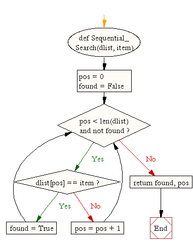

### EJERCICIO A RESOLVER: 

Tenemos la siguiente lista de elementos: [3, 56, 21, 33, 874, 123, 66, 1000,
23, 45, 65, 56].  


```python
# Creamos la lista
lista = [3, 56, 21, 33, 874, 123, 66, 1000, 23, 45, 65, 56]
lista
```


    [3, 56, 21, 33, 874, 123, 66, 1000, 23, 45, 65, 56]


1.- Construye tu propio algoritmo para ordenarlo de menor a mayor. 


```python
lista_ord = sorted(lista)
lista_ord
```


    [3, 21, 23, 33, 45, 56, 56, 65, 66, 123, 874, 1000]


 
2.- Busca el número 875 utilizando el algoritmo secuencial y el binario. En cada iteración se debe sumar +1 de modo que al final del programa se debe indicar el número de iteraciones realizadas por cada algoritmo hasta encontrar el elemento.  


```python
def Sequential_Search(dlist, item):

    pos = 0
    found = False
    
    while pos < len(dlist) and not found:
        if dlist[pos] == item:
            found = True
        else:
            pos = pos + 1
    
    return found, pos
```

OUTPUT "¿Qué número deseas buscar?"  
INPUT el usuario introduce el número   
ALMACENAR la entrada del usuario en la variable número_de_cliente  
contador = 1   
(necesitamos contar el número de registros que hemos buscado)  
more_records = True   
(necesitamos un indicador que diga si hay más registros disponibles para buscar  
o si hemos llegado al final de la base de datos)  
WHILE more_records = True:  
	IF counter = customer_number THEN  
		OUTPUT dirección del cliente  
		Salir del bucle  
ELSE  
	añadir 1 al contador  





```python
resultado = Sequential_Search(lista_ord, 874)
```


```python
print("Resultado {}, despues de {} iteraciones".format(resultado[0], resultado[1]))
```

    Resultado True, despues de 10 iteraciones


```python
def binary_searchiter(arr, n):
    pos = 0
    low = 0
    high = len(arr) - 1
    mid = 0
    while low <= high:
        pos = pos + 1
        mid = (high + low) // 2
        if arr[mid] < n:
            low = mid + 1
        elif arr[mid] > n:
            high = mid - 1
        else:
            return mid
    return pos, -1
```


```python
r = binary_searchiter(lista_ord, 875)
```


```python
if r[1] != -1:
    print("Elemento encontrado tras {} iteraciones".format(r[0]))
else: 
    print("Elemento no presente despues de {} iteraciones".format(r[0]))
```

    Elemento no presente despues de 4 iteraciones


3.- Realiza el análisis en $O$ [Notación Big O](https://www.youtube.com/watch?v=dyw0SohyEkw)

[](https://www.youtube.com/watch?v=dyw0SohyEkw "video")

(visto en la tarea #44) y describe tu conclusiones en un documento de texto.  

Debes subir a tu repositorio GitHub tanto el programa (en el lenguaje de programación que hayas elegido) y el documento de texto explicativo y razonado sobre el rendimiento y los tiempos de ejecución de cada algoritmo en notación $O Grande$.   

Por supuesto, no te olvides del diccionario.

Primero cargamos la time y la función mágica


```python
%load_ext line_profiler
```


```python
import time
```

#### Primero tratamos la busqueda secuencial


```python
%time Sequential_Search(lista_ord, 874)
```

    CPU times: user 5 µs, sys: 1 µs, total: 6 µs
    Wall time: 8.58 µs


    (True, 10)


```python
%lprun -f Sequential_Search Sequential_Search(lista_ord, 874)
```


    Timer unit: 1e-06 s
    
    Total time: 1.7e-05 s
    File: <ipython-input-3-cb195ef01b48>
    Function: Sequential_Search at line 1
    
    Line #      Hits         Time  Per Hit   % Time  Line Contents
    ==============================================================
         1                                           def Sequential_Search(dlist, item):
         2                                           
         3         1          1.0      1.0      5.9      pos = 0
         4         1          0.0      0.0      0.0      found = False
         5                                               
         6        12          5.0      0.4     29.4      while pos < len(dlist) and not found:
         7        11          4.0      0.4     23.5          if dlist[pos] == item:
         8         1          1.0      1.0      5.9              found = True
         9                                                   else:
        10        10          5.0      0.5     29.4              pos = pos + 1
        11                                               
        12         1          1.0      1.0      5.9      return found, pos


Su complejidad es O(n^2). Esto se debe a que el bucle interno tiene una complejidad O(n) y se ejecuta n veces.

#### Segúndo la secuencia binaria


```python
%time binary_searchiter(lista_ord, 874)
```

    CPU times: user 5 µs, sys: 0 ns, total: 5 µs
    Wall time: 7.39 µs


    10


```python
%lprun -f binary_searchiter binary_searchiter(lista_ord, 874)
```


    Timer unit: 1e-06 s
    
    Total time: 2.2e-05 s
    File: <ipython-input-6-e44d97b9ea77>
    Function: binary_searchiter at line 1
    
    Line #      Hits         Time  Per Hit   % Time  Line Contents
    ==============================================================
         1                                           def binary_searchiter(arr, n):
         2         1          2.0      2.0      9.1      pos = 0
         3         1          1.0      1.0      4.5      low = 0
         4         1          2.0      2.0      9.1      high = len(arr) - 1
         5         1          1.0      1.0      4.5      mid = 0
         6         3          3.0      1.0     13.6      while low <= high:
         7         3          3.0      1.0     13.6          pos = pos + 1
         8         3          3.0      1.0     13.6          mid = (high + low) // 2
         9         3          4.0      1.3     18.2          if arr[mid] < n:
        10         2          1.0      0.5      4.5              low = mid + 1
        11         1          1.0      1.0      4.5          elif arr[mid] > n:
        12                                                       high = mid - 1
        13                                                   else:
        14         1          1.0      1.0      4.5              return mid
        15                                               return pos, -1


El código tiene complejidad $Θ(log n)$, ya que el bucle interno divide por dos en cada iteración,
ejecutándose un total de log2n veces.
