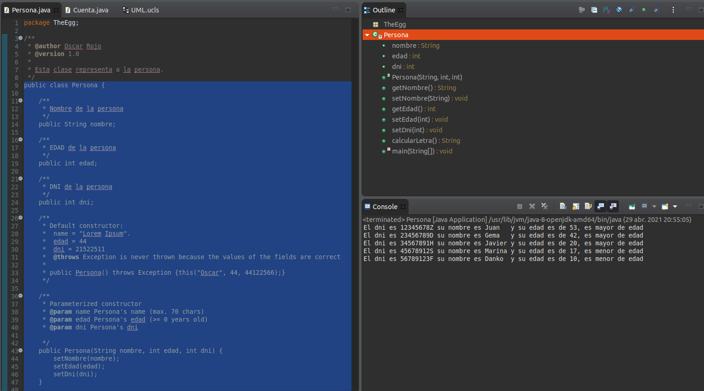
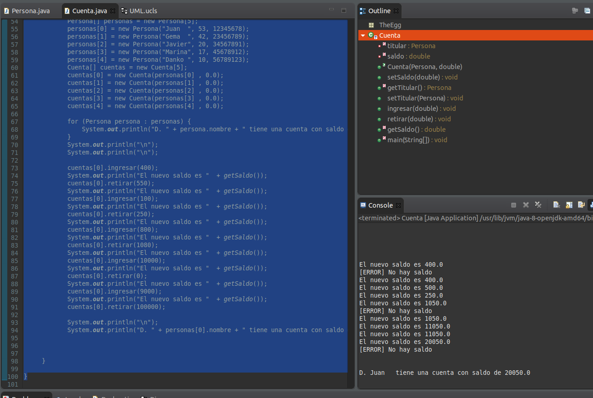
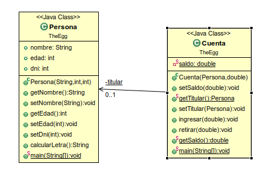

# EJERCICIO

---
1.- Crear una clase llamada Persona. Sus atributos son: nombre, edad y DNI. Construye los siguientes métodos para la clase:  
. Un constructor, donde los datos pueden estar vacíos.  
. Los setters y getters (métodos set y get) para cada uno de los atributos. Hay que validar las entradas de datos.  
. mostrar(): muestra los datos de la persona.  
. esMayorDeEdad(): devuelve un valor lógico indicando si es mayor de edad.  

---

---

2.- Crea una clase llamada Cuenta que tendrá los siguientes atributos:  
. titular (que es una persona)  
. cantidad (puede tener decimales).  
El titular será obligatorio y la cantidad es opcional. Construye los siguientes métodos para la clase:  
. Un constructor, donde los datos pueden estar vacíos.  
Los setters y getters para cada uno de los atributos. El atributo no se puede modificar directamente, sólo ingresando o 
retirando dinero.  
. mostrar(): muestra los datos de la cuenta.  
. ingresar(cantidad): se ingresa una cantidad a la cuenta, si la cantidad introducida es negativa, no se hará nada.  
. retirar(cantidad): se retira una cantidad a la cuenta. La cuenta puede estar en números rojos.  

---

---
Para su ejecución se ha utilizado como lenguaje JAVA y como IDE Eclipse

----
El UML del ejercicio

## El proyecto está guardado para importarlo en el documento [TheEgg_proyecto.zip](TheEgg_proyecto.zip)