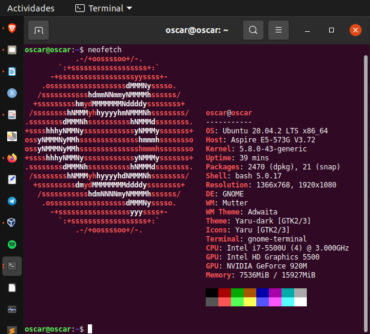
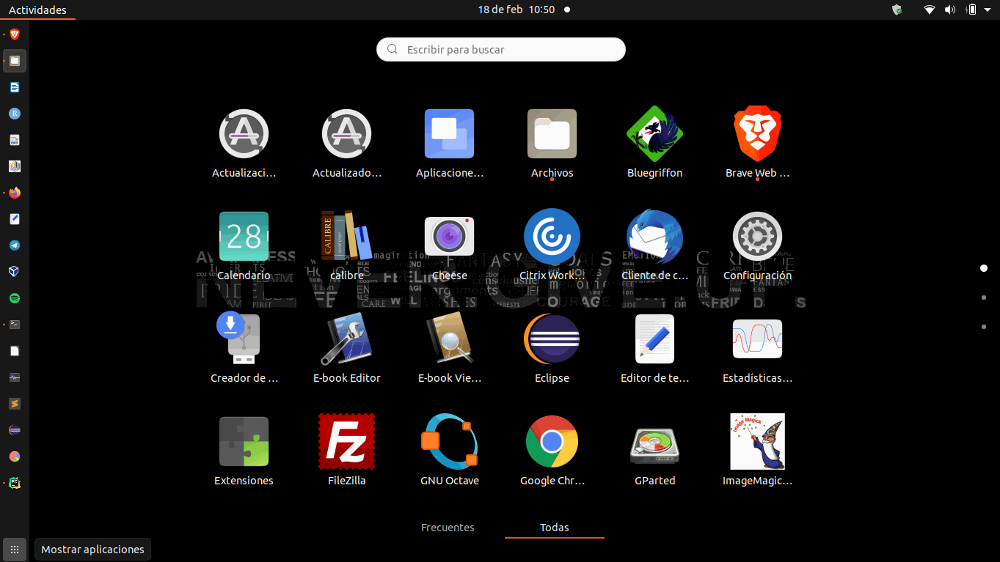
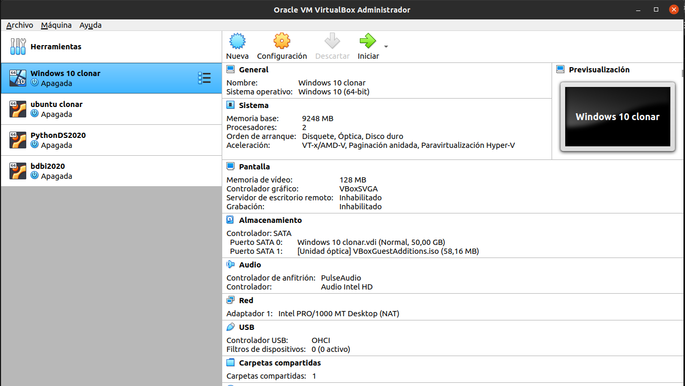
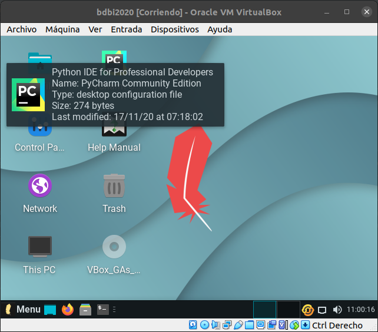
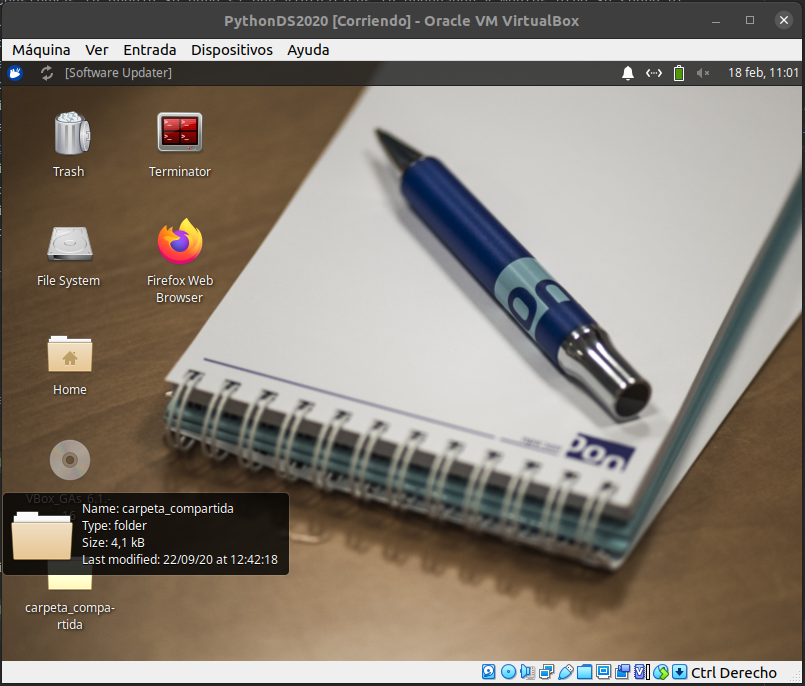
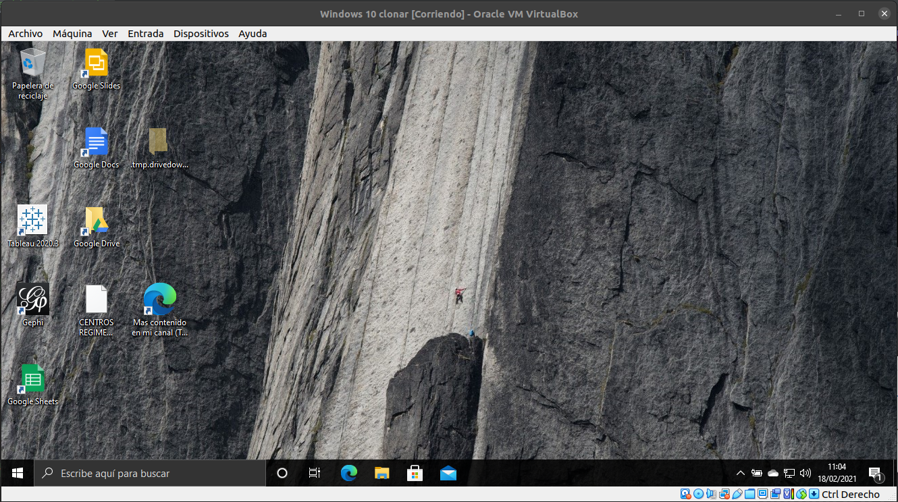
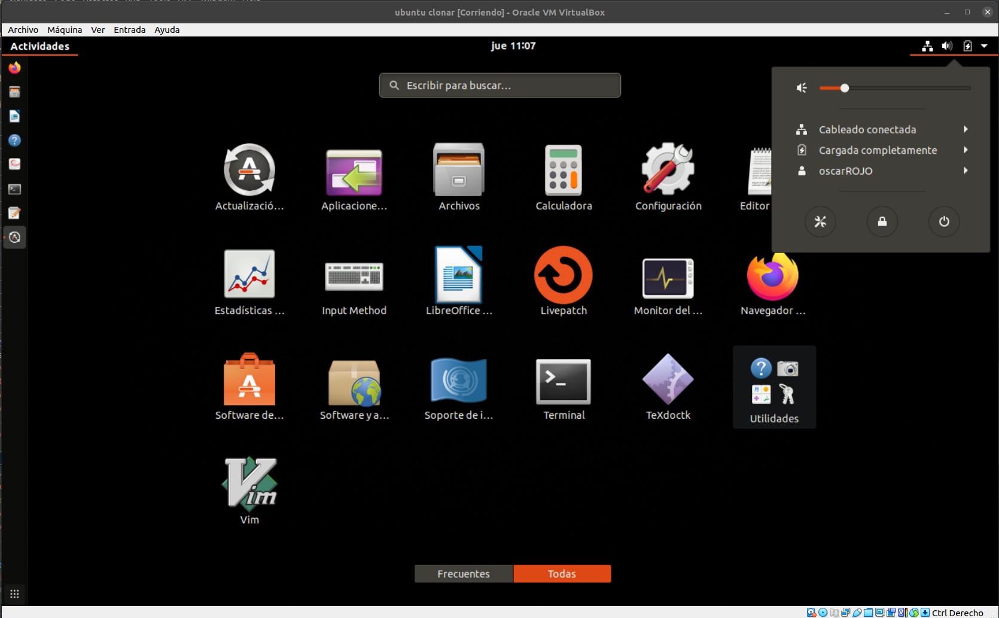

# Ejercicio propuesto: 

## En mi caso trabajo con Ubunto.

### Reproduzco software en mi SO

##  VM

Para este ejercicio utilizo ***Oracle VM VirtualBox***

## Reproduzco las diferentes máquinas virtuales que tengo

