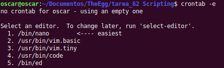
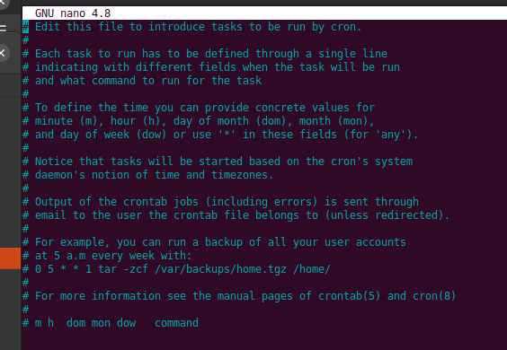
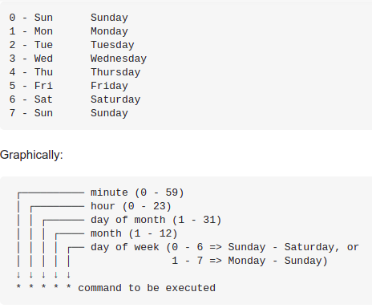

Para ejecutar un trabajo crontab en días específicos de la semana, puede especificarlo de la siguiente manera:

*1. Edite el crontab para el usuario para el que desea crear el trabajo crontab. Por ejemplo:

    $ crontab -e
    
  

A continuación, añada una entrada que especifique la fecha, la hora y el día de la semana en que desea ejecutar la tarea crontab. Por ejemplo:

Esta entrada de crontab ejecuta el script a las 17:00 (5PM) los sábados:

    0 17 * * 6 /script/script.sh

Esta entrada de crontab ejecuta el script a las 17:00 (5PM) del domingo al viernes:

    0 17 * * 0-5 /script/script.sh
    
*2. Hay más detalles sobre las diferentes opciones de crontab en las páginas man, concretamente:

    man 5 crontab
    
*3. Sin embargo, los días de la semana se pueden especificar en el número más a la derecha en los ejemplos anteriores,
con valores de 0 a 7 representando cada día de la semana y el domingo pudiendo especificarse por 0 o 7.

Otras opciones para indicar en crontb

