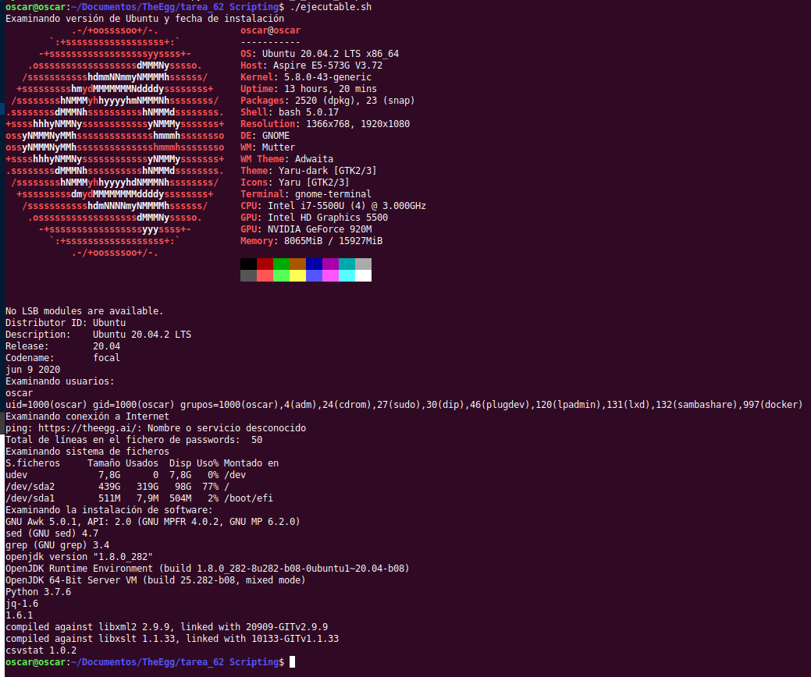

# Primer Script

Este primer Script sirve para ver la versión del SO del ordenador

Primero debemos de abrir un programa tipi Vim, Sublime Text, Editor de textos etc.


```python
! echo "Examinando versión de Ubuntu y fecha de instalación"
```

    Examinando versión de Ubuntu y fecha de instalación


```python
! lsb_release -a
```

    No LSB modules are available.
    Distributor ID:	Ubuntu
    Description:	Ubuntu 20.04.2 LTS
    Release:	20.04
    Codename:	focal


```python
! ls -alct / |tail -1|awk '{print $6, $7, $8}'
```

    Jun 9 2020


```python
! neofetch
```

    [?25l[?7l            .-/+oossssoo+/-.
            `:+ssssssssssssssssss+:`
          -+ssssssssssssssssssyyssss+-
        .ossssssssssssssssssdMMMNysssso.
       /ssssssssssshdmmNNmmyNMMMMhssssss/
      +ssssssssshmydMMMMMMMNddddyssssssss+
     /sssssssshNMMMyhhyyyyhmNMMMNhssssssss/
    .ssssssssdMMMNhsssssssssshNMMMdssssssss.
    +sssshhhyNMMNyssssssssssssyNMMMysssssss+
    ossyNMMMNyMMhsssssssssssssshmmmhssssssso
    ossyNMMMNyMMhsssssssssssssshmmmhssssssso
    +sssshhhyNMMNyssssssssssssyNMMMysssssss+
    .ssssssssdMMMNhsssssssssshNMMMdssssssss.
     /sssssssshNMMMyhhyyyyhdNMMMNhssssssss/
      +sssssssssdmydMMMMMMMMddddyssssssss+
       /ssssssssssshdmNNNNmyNMMMMhssssss/
        .ossssssssssssssssssdMMMNysssso.
          -+sssssssssssssssssyyyssss+-
            `:+ssssssssssssssssss+:`
                .-/+oossssoo+/-.
    oscar@oscar 
    ----------- 
    OS: Ubuntu 20.04.2 LTS x86_64 
    Host: Aspire E5-573G V3.72 
    Kernel: 5.8.0-43-generic 
    Uptime: 13 hours, 13 mins 
    Packages: 2520 (dpkg), 23 (snap) 
    Shell: bash 5.0.17 
    Resolution: 1366x768, 1920x1080 
    DE: GNOME 
    WM: Mutter 
    WM Theme: Adwaita 
    Theme: Yaru-dark [GTK2/3] 
    Icons: Yaru [GTK2/3] 
    Terminal: jupyter-lab 
    CPU: Intel i7-5500U (4) @ 3.000GHz 
    GPU: Intel HD Graphics 5500 
    GPU: NVIDIA GeForce 920M 
    Memory: 8054MiB / 15927MiB 
    
                            
                            
    
    
    [?25h[?7h


```python
! echo "Examinando usuarios:"
```

    Examinando usuarios:


```python
! whoami
```

    oscar


```python
! id
```

    uid=1000(oscar) gid=1000(oscar) groups=1000(oscar),4(adm),24(cdrom),27(sudo),30(dip),46(plugdev),120(lpadmin),131(lxd),132(sambashare),997(docker)


```python
! echo "Examinando conexión a Internet"
```

    Examinando conexión a Internet


```python
! ping -c 1 https://theegg.ai/
```

    ping: https://theegg.ai/: Name or service not known


```python
! a=$(wc -l /etc/passwd | cut -f 1 -d " ")
```


```python
! echo "Total de líneas en el fichero de passwords: " $a
```

    Total de líneas en el fichero de passwords: 


```python
! echo "Examinando sistema de ficheros"
```

    Examinando sistema de ficheros


```python
! df -h | grep -v loop | grep -v tmpfs
```

    Filesystem      Size  Used Avail Use% Mounted on
    udev            7.8G     0  7.8G   0% /dev
    /dev/sda2       439G  319G   98G  77% /
    /dev/sda1       511M  7.9M  504M   2% /boot/efi


### Excaminamos la instalación del software


```python
! echo "Examinando la instalación de software: "
```

    Examinando la instalación de software: 


```python
! awk -W version 2> /dev/null | head -1
```

    GNU Awk 5.0.1, API: 2.0 (GNU MPFR 4.0.2, GNU MP 6.2.0)


```python
! sed --version | head -1
```

    sed (GNU sed) 4.7


```python
! grep --version | head -1
```

    grep (GNU grep) 3.4


```python
### Vemos las versiones de diferentes programas
```


```python
! java -version
```

    openjdk version "1.8.0_282"
    OpenJDK Runtime Environment (build 1.8.0_282-8u282-b08-0ubuntu1~20.04-b08)
    OpenJDK 64-Bit Server VM (build 25.282-b08, mixed mode)


```python
! python --version
```

    Python 3.7.6


Todo Junto:

    #!/bin/bash
    echo "Examinando versión de Ubuntu y fecha de instalación"
    neofetch
    lsb_release -a
    ls -alct / |tail -1|awk '{print $6, $7, $8}'
    echo "Examinando usuarios:"
    whoami
    id
    a=$(wc -l /etc/passwd | cut -f 1 -d " ")
    echo "Examinando conexión a Internet"
    ping -c 1 https://theegg.ai/
    echo "Total de líneas en el fichero de passwords: " $a
    echo "Examinando sistema de ficheros"
    df -h | grep -v loop | grep -v tmpfs
    echo "Examinando la instalación de software: "
    awk -W version 2> /dev/null | head -1
    sed --version | head -1
    grep --version | head -1
    java -version
    python --version

Una vez generado el fichero, lo guardamos con la terminación .sh  en este caso, "informe.sh"

Para todo script, es necesario darle permisos de ejecución
Otorgar permisos de ejecución y ejecutarlos indicando la ruta:

    "usuario@nombreMaquina:~$ chmod +x extrae.sh"    
    "usuario@nombreMaquina:~$ ./extrae.sh"    


