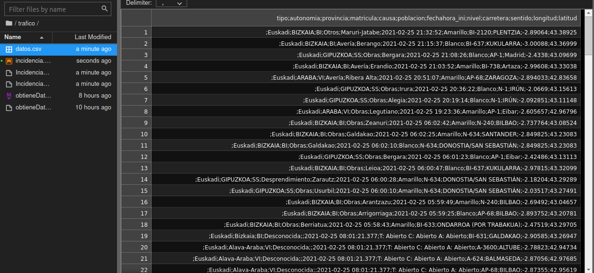

# Incidencias Trafico Euskadi

Andes de nada, tenemos que tener instalado xmlstarlet para poder parsear el fichero xml que generemos.


```python
#!/bin/bash
# Script para tratar datos.
```


```python
# Accedemos primero a la carpeta donde deseamos realizar todo el tratamiento.
! cd /home/oscar/Documentos/TheEgg/tarea_62 Scripting/trafico
```

    /bin/bash: line 0: cd: too many arguments


```python
# Suprimimos posibles ficheros anteriores.
# El parámetro -f fuerza a no pedir nada al usuario.
! rm -f IncidenciasTrafikoTDTGeoZip
! rm -f IncidenciasTDTGeo*.xml
! rm -f datos.csv
```


```python
# Obtenemos el fichero y lo descomprimimos.
! wget https://www.trafikoa.eus/servicios/IncidenciasTDT/IncidenciasTrafikoTDTGeoZip
! unzip IncidenciasTrafikoTDTGeo*
```

    --2021-02-25 21:43:39--  https://www.trafikoa.eus/servicios/IncidenciasTDT/IncidenciasTrafikoTDTGeoZip
    Resolving www.trafikoa.eus (www.trafikoa.eus)... 195.235.171.9
    Connecting to www.trafikoa.eus (www.trafikoa.eus)|195.235.171.9|:443... connected.
    HTTP request sent, awaiting response... 200 OK
    Length: 5440 (5.3K) [application/zip]
    Saving to: 'IncidenciasTrafikoTDTGeoZip'
    
    IncidenciasTrafikoT 100%[===================>]   5.31K  --.-KB/s    in 0.002s  
    
    2021-02-25 21:43:40 (2.62 MB/s) - 'IncidenciasTrafikoTDTGeoZip' saved [5440/5440]
    
    Archive:  IncidenciasTrafikoTDTGeoZip
      inflating: IncidenciasTDTGeo.xml   


```python
# Parseamos el fichero .xml y generamos un fichero .csv
! 	xmlstarlet sel -t \
	  -m / -o "tipo;autonomia;provincia;matricula;causa;poblacion;fechahora_ini;nivel;carretera;sentido;longitud;latitud" -n -b \
	  -m /raiz/incidenciaGeolocalizada  \
	  -v ../tipo -o ";" -v autonomia -o ";" \
	  -v provincia -o ";" -v matricula -o ";" \
	  -v causa -o ";" -v poblacion -o ";" \
	  -v fechahora_ini -o ";" -v nivel -o ";" \
	  -v carretera -o ";" -v sentido -o ";" \
	  -v longitud -o ";" -v latitud -n \
	IncidenciasTDTGeo.xml > datos.csv
```

Agregamos permisos de ejecución a este fichero con el comando chmod:

	oscar@oscar:~/Documentos/TheEgg/tarea_62 Scripting/trafico$  chmod +x obtieneDatos.sh
	oscar@oscar:~/Documentos/TheEgg/tarea_62 Scripting/trafico$  ./obtieneDatos.sh


```python
### Agregar una línea al fichero «/etc/crontab» que automatizaría la ejecución:
```

30 7 2 * *     usuario     /home/oscar/Documentos/TheEgg/tarea_62 Scripting/traficoobtieneDatos.sh    
A las 7:30 del día 2 de cada mes, en esta carpeta habrá un fichero «datos.csv»

## Resultado



